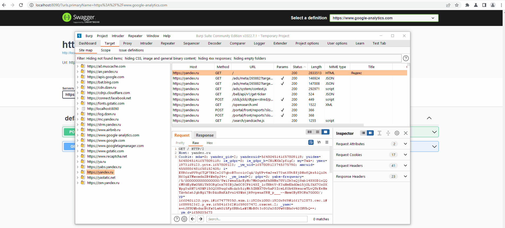

# Burp2Swagger

#### This extension was written during [Digital Security's](https://dsec.ru) -  [Summ3r Of H4ck 2022](https://dsec.ru/about/vacancies/#internship) internship

Burp Suite extension for creating OpenApi Json from burp proxy and viewing them in locally hosted Swagger UI.

# Features 

- [x] Supports multiple domains [(Gif)](./images/multi.gif)
- [x] File uploads for form-data requests [(Gif)](./images/upload.gif)
- [x] Basic and Bearer authentication in every json [(Gif)](./images/auth.gif)
- [x] Parameters examples taken from requests [(Gif)](./images/param.gif)
- [x] Local Swagger-UI on `localhost:8090`
- [x] Cors bypass for local swagger-ui [(Gif)](./images/cors.gif)
- [x] Adding domains from burp's site map.

# Installation
Please note that the SimpleFileServer was added in Java 18, so that is the required java version
- Grab a compiled jar from releases and add it in extender
- Or clone the repo and build artifacts in Idea

# ToDo

- [ ] Menu for extension's functions
- [ ] Fix bugs
- [ ] Research Swagger customisation
- [ ] Make a Java 17- version